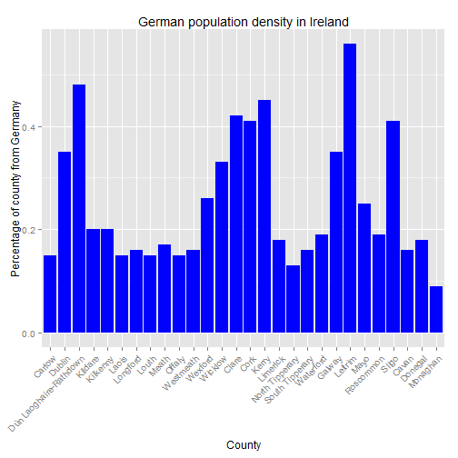

## Where in Ireland do I fit in?

# Exploring and matching Demographics in Ireland  
       

Demographic data from the Irish census of 2011 is readily available online at [Irish Census Data 2011] (http://www.cso.ie/en/census/census2011reports/). However, the analysis options offered are a little rigid, with limited interactivity.   
   
In particular, there is no interactive ranking of counties by demographic markers offered, to answer questions such as:  

- *Which county has the highest per capita percentage of people aged 85 or older?*         
- *Which county has the lowest density of people who completed schooling with a PhD?*     
- *Which county has the highest population density of US-born residents?*         
 
The purpose of my Shiny application is to offer a user-friendly framework in which to answer questions like that, by directly accessing the official online census data and creating rankings of counties by demographic markers based on user input.

---    

## Sample Use Case

I could be a German who is moving to Ireland and cherishes being near other native Germans. I could analyze the data and produce a plot.  
It would seem, in this case, that *Leitrim* may be the county of my dreams.

 

---  .class #id

## Expanding to multiple demographic perspectives
 
However, I may be interested in looking at the best fit from other perspectives: perhaps I want to see where the largest proportion of people in my age group live; perhaps I am interested to see where the greatest proportion of people with a similar educational background live.  

This is the purpose of the [Where in Ireland do I fit in] (https://tomany.shinyapps.io/Shinyproj) application.

With this application, we can analyze the closest (and least close) demographic fit by county in the following areas:   
 

- Education
- Nationality
- Sex
- Marital Status
- Age Group   

--- .class #id

## Operation of the application

The user simply selects the demographic category in each of the rubrics which describes the desired population of where they would like to live.   
 
The output contains a description tab and 5 tabs, each for one demographic category chosen.    
 
The counties are ranked by population percentage most aligned with the demographic category in each area to least.  
 
The application is interactive, and to change the reference demographic category, the user simply selects an alternative category and the ranking is automatically adjusted.

